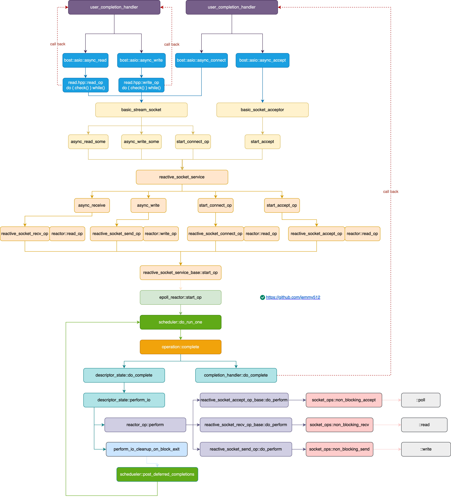

# Agenda
* [io_context::run](#io_contextrun)
* [async_accept](#async_accept)
* [async_connect](#async_connect)
* [async_read](#async_read)
* [async_write](#async_write)
* [io_context::post](#io_contextpost)

# UML




# io_context::run
```c++
io_context::run()
    scheduler::run()
        thread_info this_thread;
        this_thread.private_outstanding_work = 0;

        for (do_run_one(&this_thread)) {
            while (!Stop) {
                if (!op_queue_.empty()) {
                    operation* o = op_queue_.front()
                    if (o == &task_operation_) {
                        if (more_handlers && !one_thread_)
                            wakeup_event_.unlock_and_signal_one(lock);
                        else
                            lock.unlock();

                        task_cleanup on_exit = { this, &lock, &this_thread };

                        epoll_reactor::run(this_thread.private_op_queue) {
                            epoll_wait()
                            for (int i = 0; i < num_events; ++i) {
                                void* ptr = events[i].data.ptr;
                                if (ptr == &interrupter_) {

                                } else if (ptr == &timer_fd_) {
                                    check_timers = true;
                                } else {
                                    descriptor_state* descriptor_data = static_cast<descriptor_state*>(ptr);
                                    if (!ops.is_enqueued(descriptor_data)) {
                                        descriptor_data->set_ready_events(events[i].events);
                                            task_result_ = events;
                                        ops.push(descriptor_data);
                                    } else {
                                        descriptor_data->add_ready_events(events[i].events);
                                            task_result_ |= events;
                                    }
                                }
                            }
                        }

                        /* when complete the epoll task add it back again into the op_queue
                         * so there always is a thead runs task_operation_.
                         *
                         * If there's no other tasks and epoll events,
                         * this thread blocks at epoll_wait. When add a new task [1]
                         * into op_queue, scheduler::wake_one_thread_and_unlock wakes up the
                         * epoll_wait, but there's no epoll_event, epoll_reactor::run returns
                         * immediately and add task_operation_ [2] again into op_queue.
                         * The thead continues its next `while` loop, gets task [1] from op_queue,
                         * since op_queue has task[2], this thread `unlock_and_signal_one`
                         * another thread to run task_operation_ [2], it runs task [1]
                         *
                         * The other thread will block at epoll_wait,
                         * task_operation_ ran by every thread in turn. */

                        ~task_cleanup() {
                            scheduler_->task_interrupted_ = true;
                            scheduler_->op_queue_.push(this_thread_->private_op_queue);
                            scheduler_->op_queue_.push(&scheduler_->task_operation_);
                        }
                    } else {
                        o->complete(this, ec, task_result)
                    }
                } else {
                    wakeup_event_.clear(lock);
                    wakeup_event_.wait(lock);
                        ::pthread_cond_wait()
                }
            }
        }

        ~thread_info_base()
            ~op_queue()
                op_queue_access::destroy(op);
                    op->destroy()
                        scheduler_operation::destroy()
                            func_(0, this, boost::system::error_code(), 0)
```

# async_accept
```C++
basic_socket_acceptor::async_accept()
    reactive_socket_service::async_accept()
        reactive_socket_accept_op op()
        reactive_socket_service_base::start_accept_op(op) 
            if (!peer_is_open)
                reactive_socket_service_base::start_op(reactor::read_op)
                    if (socket_ops::set_internal_non_blocking())
                        epoll_reactor::start_op(op, reactor::read_op)
                            if (allow_speculative && (op_type != read_op || descriptor_data->op_queue_[except_op].empty()))
                                reactor_op::perform()
                                    reactive_socket_accept_op_base::do_perform()
                                        socket_ops::non_blocking_accept()
                                            ::poll() // fd writable means it is connected
                                schedueler::post_immediate_completion()
                                    schedule::do_run_one()
                                        operation::complete()
                                            reactive_socket_accept_op::do_complete()
                                                --->
                            else
                                descriptor_data->op_queue_[op_type].push(op)
                                    // when client request connect, listen socket wake up from epoll
                                    scheduler::do_run_one()
                                        operation::complete()
                                            descriptor_state::do_complete()
                                                descriptor_state::perform_io() // loop op_queue[]
                                                    reactor_op::perform()
                                                        reactive_socket_accept_op_base::do_perform()
                                                            --->
                                                        ~perform_io_cleanup_on_block_exit()
                                                            schedueler::post_deferred_completions()
                                                                schedule::do_run_one()
                                                                    operation::complete()
                                                                        reactive_socket_accept_op::do_complete()
                                                                            --->
                    else // blocking io
                        epoll_reactor::post_immediate_completion()
            else // peer_is_open
                schedule::post_immediate_completion()
                    schedule::do_run_one()
                        operation::complete()
                            reactive_socket_accept_op::do_complete()
                                reactive_socket_accept_op::do_assign()
                                    basic_scoket::assign()
                                        reactive_descriptor_service::assign()
                                            epoll_reactor::register_descriptor()
                                                ev.events = EPOLLIN | EPOLLERR | EPOLLHUP | EPOLLPRI | EPOLLET;
                                                epoll_ctl(epoll_fd_, EPOLL_CTL_ADD, descriptor, &ev)
```

# async_connect

```C++
basic_stream_socket::async_connect()
    reactive_socket_service::async_connect()
        if (!is_open())
            reactive_socket_service_base::do_open()
                epoll_reactor::register_descriptor()
                    ev.events = EPOLLIN | EPOLLERR | EPOLLHUP | EPOLLPRI | EPOLLET;
                    epoll_ctl(epoll_fd_, EPOLL_CTL_ADD, descriptor, &ev)
        reactive_socket_connect_op<Handler> op();
        reactive_socket_service_base::start_connect_op(op)
            if (socket_ops::set_internal_non_blocking())
                socket_ops::connect()
                    ::connect(s, addr, (SockLenType)addrlen)
                epoll_reactor::start_op(op, reactor::connect_op)
                    if (allow_speculative && (op_type != read_op || descriptor_data->op_queue_[except_op].empty()))
                        operation::perform()
                            reactive_socket_connect_op_base::do_perform()
                                socket_ops::non_blocking_connect()
                                    ::poll(&fds, 1, 0); // fd writable means it's connected
                        schedueler::post_immediate_completion()
                    else
                        descriptor_data->op_queue_[op_type].push(op)
                            schedule::do_run_one()
                                operation::complete()
                                    descriptor_state::do_complete()
                                        descriptor_state::perform_io() // loop op_queue[]
                                            operation::perform()
                                                reactive_socket_connect_op_base::do_perform()
                                                    --->
                                                ~perform_io_cleanup_on_block_exit()
                                                    schedule::post_deferred_completions(op)
                                                        schedule::do_run_one()
                                                            operation::complete()
                                                                reactive_socket_connect_op::do_complete()
                                                                    user_callback()
            else
                schedule::post_immediate_completion(op, is_continuation);
                    schedule::do_run_one()
                        operation::complete()
                            reactive_socket_connect_op::do_complete()
                                user_callback()
```

# async_read
```C++
template <typename AsyncReadStream, typename Allocator, typename ReadHandler>

template <typename AsyncReadStream, typename Allocator, typename CompletionCondition, typename ReadHandler>

template <typename AsyncReadStream, typename DynamicBuffer, typename ReadHandler>
async_read(AsyncReadStream& s, DynamicBuffer buffers, ReadHandler handler,
    typename enable_if<is_dynamic_buffer<typename decay<DynamicBuffer>::type>::value>::type* = 0);

template <typename AsyncReadStream, typename DynamicBuffer, typename CompletionCondition, typename ReadHandler>

template <typename AsyncReadStream, typename MutableBufferSequence, typename ReadHandler>

template <typename AsyncReadStream, typename MutableBufferSequence, typename CompletionCondition, typename ReadHandler>

template <typename AsyncReadStream, typename MutableBufferSequence,typename CompletionCondition, typename ReadHandler>

read.hpp::async_read_until()
    read.hpp::start_read_buffer_sequence_op()
        read.hpp::read_op()
            basic_stream_socket::async_read_some()
                this->get_service().async_receive(this->get_implementation(), buffers, 0, init.completion_handler)
                reactive_socket_service_base::async_receive()
                    reactive_socket_recv_op op()
                    reactive_socket_service_base::start_op(op)
                        epoll_reactor::start_op(op, reactor::read_op)
                            if (allow_speculative && (op_type != read_op || descriptor_data->op_queue_[except_op].empty()))
                                operation::perform()
                                    reactive_socket_recv_op_base::do_perform()
                                        socket_ops::non_blocking_recv()
                                            socket_ops::recv
                                scheduler::post_immediate_completion()
                                    schedule::do_run_one()
                                        operation::complete()
                                            reactive_socket_recv_op::do_complete()
                                                user_callback()
                            else
                                descriptor_data->op_queue_[op_type].push(op)
                                    // when client request connect, listen socket wake up from epoll
                                    scheduler::do_run_one()
                                        operation::complete()
                                            descriptor_state::do_complete()
                                                descriptor_state::perform_io() // loop op_queue[]
                                                    reactor_op::perform()
                                                        reactive_socket_recv_op_base::do_perform()
                                                            --->
                                                        ~perform_io_cleanup_on_block_exit()
                                                            scheduler::post_deferred_completions()
                                                                schedule::do_run_one()
                                                                    operation::complete()
                                                                        reactive_socket_recv_op::do_complete()
                                                                            user_callback()
```

# async_write
```C++
template <typename AsyncWriteStream, typename ConstBufferSequence, typename CompletionCondition, typename WriteHandler>

template <typename AsyncWriteStream, typename ConstBufferSequence, typename WriteHandler>

template <typename AsyncWriteStream, typename DynamicBuffer, typename WriteHandler>

template <typename AsyncWriteStream, typename DynamicBuffer, typename CompletionCondition, typename WriteHandler>

template <typename AsyncWriteStream, typename Allocator, typename WriteHandler>

template <typename AsyncWriteStream, typename Allocator, typename CompletionCondition, typename WriteHandler>


boost::asio::async_write(m_socket, buffer, writeHandler);
    write.hpp::async_write(stream, buffer, completion, handler)
        write.hpp::start_write_buffer_sequence_op(stream, buffer, bufferIterator, completion_condition, handler)
            write_op<AsyncWriteStream, ConstBufferSequence, ConstBufferIterator, CompletionCondition, WriteHandler>(
                stream, buffers, completion_condition, handler
            )(boost::system::error_code(), 0, 1); // (error_code, bytes_transferred, start)
                write.hpp::write_op::operator()             // while loop until write completed
                    ssl::stream.hpp::async_write_some       // while loop until write completed
                        ssl::io.hpp::async_io()
                            ssl::io.hpp::io_op::operator()  // while loop until write completed
                                ssl::write_op.hpp::operator()
                                    ssl::engine::write()
                                        ssl::engine::perform()
                                            ssl::engin::write()
                                                ::SSL_write()

                    basic_stream_socket::async_write_some(buffer, handler/*write_op*/)
                        reactive_socket_service_base::async_send()
                            reactive_socket_send_op<ConstBufferSequence, Handler> op()
                            reactive_socket_service_base::start_op(op, reactor::write_o)
                                epoll_reactor::start_op(op, reactor::write_op)
                                    if (allow_speculative && (op_type != read_op || descriptor_data->op_queue_[except_op].empty()))
                                        reactor_op::perform()
                                            reactive_socket_send_op::do_perform()
                                                    socket_ops::non_blocking_send()
                                                        socket_ops::sendmsg
                                        epoll_reactor::post_immediate_completion()
                                            schedule::do_run_one()
                                                operation::complete()
                                                    reactive_socket_send_op::do_complete()
                                                        user_callback()
                                    else
                                        descriptor_data->op_queue_[op_type].push(op)
                                            // when client request connect, listen socket wake up from epoll
                                            scheduler::do_run_one()
                                                operation::complete()
                                                    descriptor_state::do_complete()
                                                        descriptor_state::perform_io() // loop op_queue[]
                                                            reactor_op::perform()
                                                                reactive_socket_send_op::do_perform()
                                                                    --->
                                                                ~perform_io_cleanup_on_block_exit()
                                                                    scheduler::post_deferred_completions()
                                                                        schedule::do_run_one()
                                                                            operation::complete()
                                                                                reactive_socket_send_op::do_complete()
                                                                                    user_callback()
```

tricky switch
```C++
struct write_op {
  void operator()(const boost::system::error_code& ec, std::size_t bytes_transferred, int start = 0) {
    std::size_t max_size;
    switch (start_ = start) {
    case 1:
      max_size = this->check_for_completion(ec, buffers_.total_consumed());
      do {
        stream_.async_write_some(buffers_.prepare(max_size), BOOST_ASIO_MOVE_CAST(write_op)(*this));
        return;

    default:
          buffers_.consume(bytes_transferred);
          if ((!ec && bytes_transferred == 0) || buffers_.empty())
            break;
          max_size = this->check_for_completion(ec, buffers_.total_consumed());
      } while (max_size > 0);

      handler_(ec, buffers_.total_consumed());
    }
  }
};
```

# io_context::post
```C++
template <typename LegacyCompletionHandler>
BOOST_ASIO_INITFN_RESULT_TYPE(LegacyCompletionHandler, void ())
io_context::post((LegacyCompletionHandler) handler)
{
  async_completion<LegacyCompletionHandler, void ()> init(handler);

  bool is_continuation = boost_asio_handler_cont_helpers::is_continuation(init.completion_handler);

  // Allocate and construct an operation to wrap the handler.
  typedef detail::completion_handler<typename handler_type<LegacyCompletionHandler, void ()>::type> op;
  typename op::ptr p = { detail::addressof(init.completion_handler), op::ptr::allocate(init.completion_handler), 0 };
  p.p = new (p.v) op(init.completion_handler);

  impl_.post_immediate_completion(p.p, is_continuation);
  p.v = p.p = 0;

  return init.result.get()
}

#define BOOST_ASIO_DEFINE_HANDLER_PTR(op)
struct ptr
{
    Handler* h;
    op* v;
    op* p;

    ~ptr() {
        reset()
    }

    static op* allocate(Handler& handler) {
        typedef typename ::boost::asio::associated_allocator<Handler>::type associated_allocator_type;
        typedef typename ::boost::asio::detail::get_hook_allocator<Handler, associated_allocator_type>::type hook_allocator_type;

        BOOST_ASIO_REBIND_ALLOC(hook_allocator_type, op)
            a(::boost::asio::detail::get_hook_allocator<Handler, associated_allocator_type>
                ::get(handler, ::boost::asio::get_associated_allocator(handler)));
        return a.allocate(1);
    }

    void reset() {
        if (p) {
            p->~op();
            p = 0;
        }

        if (v) {
            typedef typename ::boost::asio::associated_allocator<Handler>::type associated_allocator_type;
            typedef typename ::boost::asio::detail::get_hook_allocator<Handler, associated_allocator_type>::type hook_allocator_type;

            BOOST_ASIO_REBIND_ALLOC(hook_allocator_type, op)
                a(::boost::asio::detail::get_hook_allocator<Handler, associated_allocator_type>
                    ::get(*h, ::boost::asio::get_associated_allocator(*h)));
            a.deallocate(static_cast<op*>(v), 1);
            v = 0;
        }
    }
}

void scheduler::post_immediate_completion(scheduler::operation* op, bool is_continuation)
{
  work_started()
  mutex::scoped_lock lock(mutex_);
  op_queue_.push(op);
  wake_one_thread_and_unlock(lock);
    scheduler::wake_one_thread_and_unlock()
        epoll_reactor::interrupt() {
            epoll_event ev = { 0, { 0 } };
            ev.events = EPOLLIN | EPOLLERR | EPOLLET;
            ev.data.ptr = &interrupter_;
            epoll_ctl(epoll_fd_, EPOLL_CTL_MOD, interrupter_.read_descriptor(), &ev);
        }
}
```
